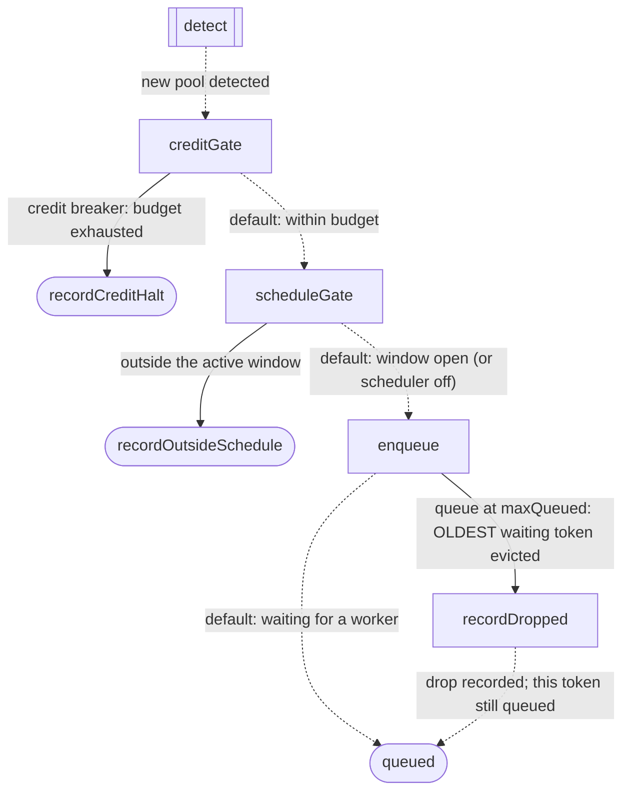
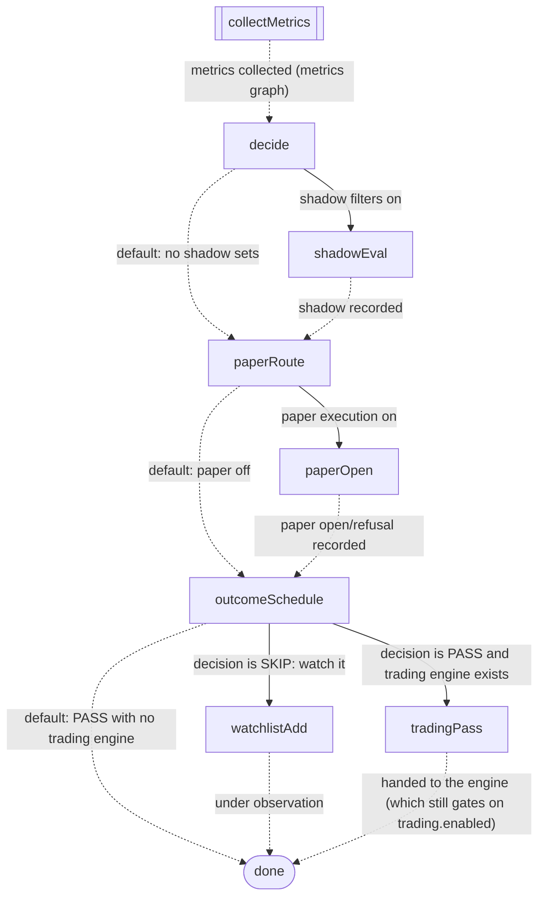
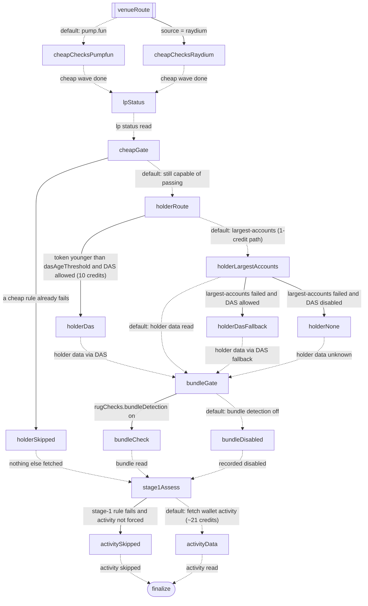

# OPIUMO pipeline graphs

<!-- GENERATED by `npm run graph:render` from src/graph/*.ts - do not edit by hand -->

### 1. Detection (per newPool event)

Runs synchronously on every detected pool. Ends by queuing the token, or by recording exactly why it was not evaluated.

8 nodes, 8 edges, **3 conditional**. Solid arrows are conditional edges (taken when their label holds, checked in order); dotted arrows are the default route.

| from | condition | to |
|---|---|---|
| detect | _new pool detected_ | creditGate |
| creditGate | **credit breaker: budget exhausted** | recordCreditHalt |
| creditGate | _default: within budget_ | scheduleGate |
| scheduleGate | **outside the active window** | recordOutsideSchedule |
| scheduleGate | _default: window open (or scheduler off)_ | enqueue |
| enqueue | **queue at maxQueued: OLDEST waiting token evicted** | recordDropped |
| enqueue | _default: waiting for a worker_ | queued |
| recordDropped | _drop recorded; this token still queued_ | queued |

### 2. Worker (per dequeued token)

Collects metrics (graph 3), decides, records - then everything that must not influence the decision.

9 nodes, 12 edges, **4 conditional**. Solid arrows are conditional edges (taken when their label holds, checked in order); dotted arrows are the default route.

| from | condition | to |
|---|---|---|
| collectMetrics | _metrics collected (metrics graph)_ | decide |
| decide | **shadow filters on** | shadowEval |
| decide | _default: no shadow sets_ | paperRoute |
| shadowEval | _shadow recorded_ | paperRoute |
| paperRoute | **paper execution on** | paperOpen |
| paperRoute | _default: paper off_ | outcomeSchedule |
| paperOpen | _paper open/refusal recorded_ | outcomeSchedule |
| outcomeSchedule | **decision is SKIP: watch it** | watchlistAdd |
| outcomeSchedule | **decision is PASS and trading engine exists** | tradingPass |
| outcomeSchedule | _default: PASS with no trading engine_ | done |
| watchlistAdd | _under observation_ | done |
| tradingPass | _handed to the engine (which still gates on trading.enabled)_ | done |

### 3. Metrics collection (inside collectMetrics)

Cheap checks first, venue-routed; the expensive holder, bundle and activity calls only for tokens still capable of passing.

18 nodes, 24 edges, **7 conditional**. Solid arrows are conditional edges (taken when their label holds, checked in order); dotted arrows are the default route.

| from | condition | to |
|---|---|---|
| venueRoute | **source = raydium** | cheapChecksRaydium |
| venueRoute | _default: pump.fun_ | cheapChecksPumpfun |
| cheapChecksPumpfun | _cheap wave done_ | lpStatus |
| cheapChecksRaydium | _cheap wave done_ | lpStatus |
| lpStatus | _lp status read_ | cheapGate |
| cheapGate | **a cheap rule already fails** | holderSkipped |
| cheapGate | _default: still capable of passing_ | holderRoute |
| holderSkipped | _nothing else fetched_ | stage1Assess |
| holderRoute | **token younger than dasAgeThreshold and DAS allowed (10 credits)** | holderDas |
| holderRoute | _default: largest-accounts (1-credit path)_ | holderLargestAccounts |
| holderDas | _holder data via DAS_ | bundleGate |
| holderLargestAccounts | **largest-accounts failed and DAS allowed** | holderDasFallback |
| holderLargestAccounts | **largest-accounts failed and DAS disabled** | holderNone |
| holderLargestAccounts | _default: holder data read_ | bundleGate |
| holderDasFallback | _holder data via DAS fallback_ | bundleGate |
| holderNone | _holder data unknown_ | bundleGate |
| bundleGate | **rugChecks.bundleDetection on** | bundleCheck |
| bundleGate | _default: bundle detection off_ | bundleDisabled |
| bundleCheck | _bundle read_ | stage1Assess |
| bundleDisabled | _recorded disabled_ | stage1Assess |
| stage1Assess | **stage-1 rule fails and activity not forced** | activitySkipped |
| stage1Assess | _default: fetch wallet activity (~21 credits)_ | activityData |
| activitySkipped | _activity skipped_ | finalize |
| activityData | _activity read_ | finalize |

**Total: 44 edges, 14 conditional** - roughly how many places a routing bug could have been hiding.
